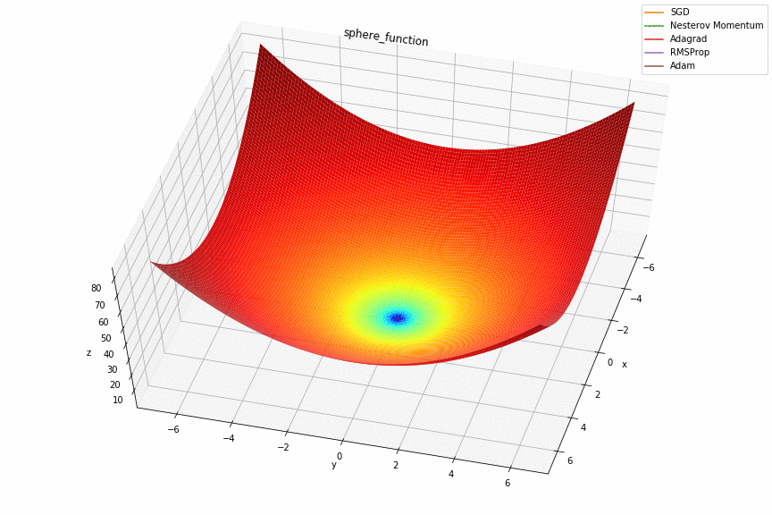
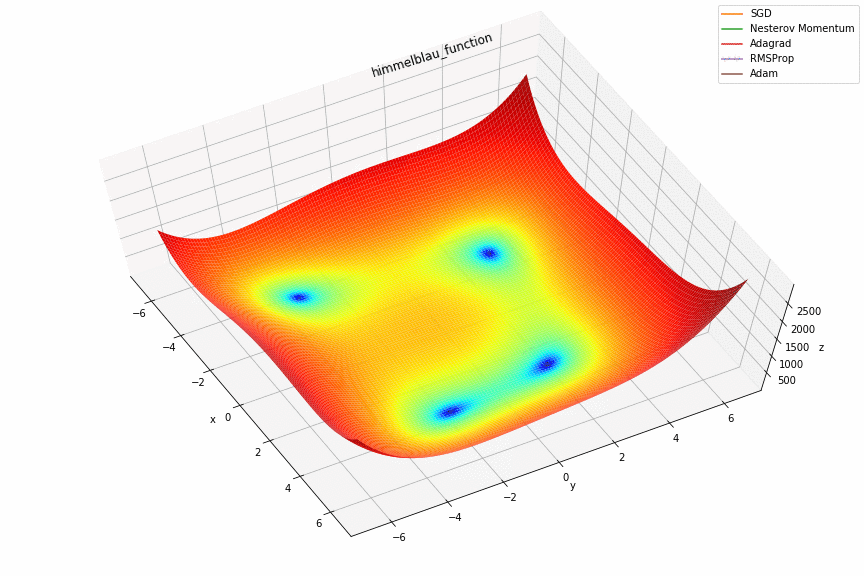

# Assignment 2 (2018-2019)

## FCNet for image classification (results)
| Dataset | Test accuracy | Update rule | Epochs |
| :---: | :---: | :---: | :---: |
| MNIST | 0.94 | SGD | 50 |
| MNIST | 0.98 | Nesterov Momentum | 50 |
| MNIST | 0.98 | Adam | 50 |

## Update rule examples on simple functions
  

## References
1. https://blog.paperspace.com/intro-to-optimization-in-deep-learning-gradient-descent/
2. https://blog.paperspace.com/intro-to-optimization-momentum-rmsprop-adam/
3. http://ruder.io/optimizing-gradient-descent/
4. http://cs231n.github.io/neural-networks-3/
5. https://www.youtube.com/watch?v=0qUAb94CpOw
