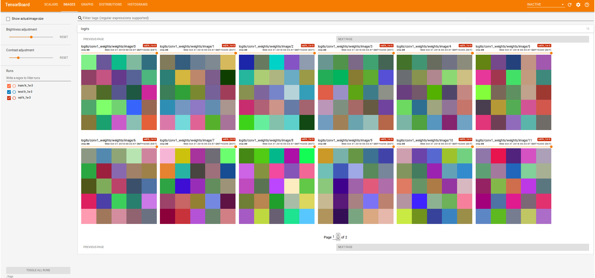
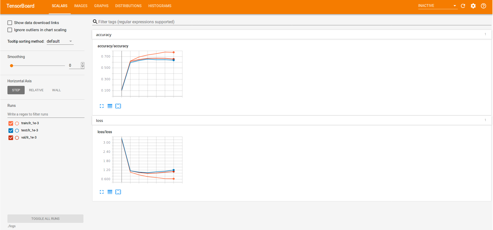

# Assignment 3 (2018-2019)

## TensorFlow results
1. `ConvNet_CIFAR10_TensorFlow.ipynb`
2. `$ tensorboard --logdir=./logs`

| Dataset split | Loss | Accuracy | Epoch |
| :---: | :---: | :---: | :---: |
| Train (random 10,000) | 0.76 | 72.84% | 15 |
| Validation (1,000) | 0.98 | 66.80% | 15 |
| Test (10,000) | 1.03 | 65.37% | 15 |

### Conv1 weights/filters
These weights/filters are ugly. I expected to see edge or color filters, not random values.

### Loss and Accuracy

