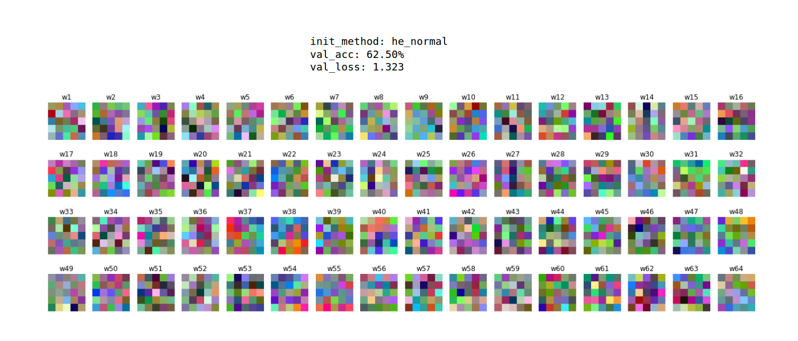
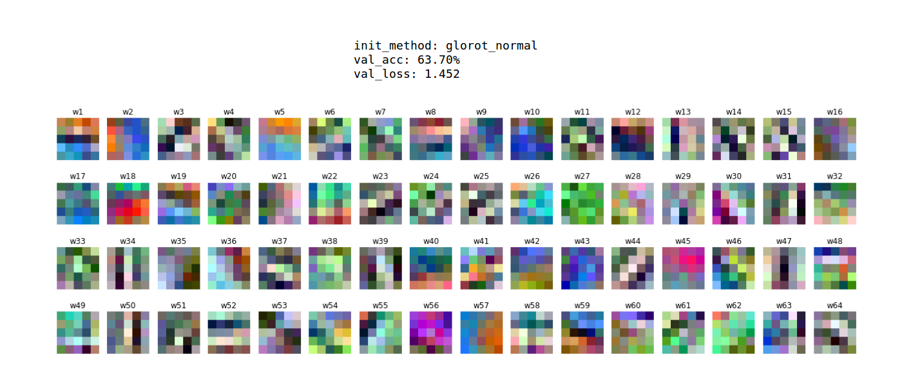
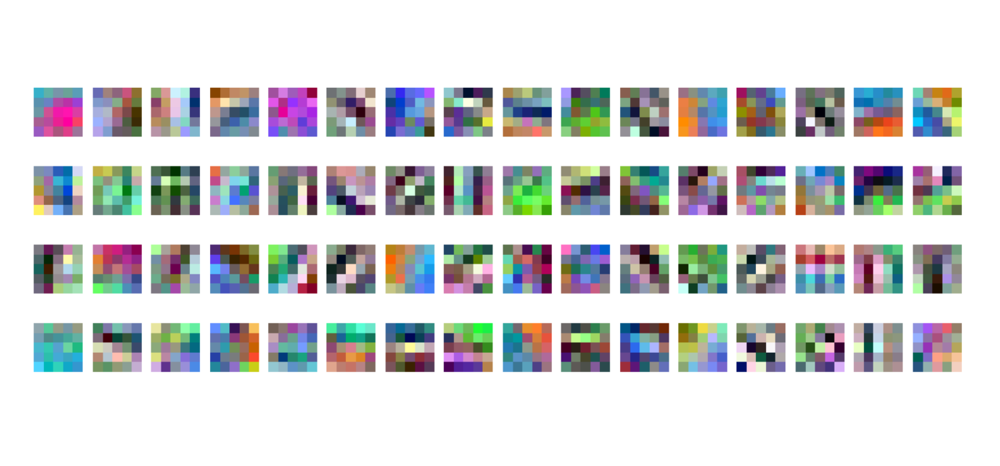

# Assignment 3 (2018-2019)

## TensorFlow results
1. `ConvNet_CIFAR10_TensorFlow.ipynb`
2. `$ tensorboard --logdir=./logs`

| Dataset split | Initialization method | Loss | Accuracy | Epoch |
| :--- | :---: | :---: | :---: | :---: |
| Train (random 1,000) | he_normal | 0.72 | 75.50% | 15 |
| Validation (1,000) | he_normal | 1.32 | 62.50% | 15 |
| Test (random 1,000) | he_normal | 1.36 | 60.80% | 15 |
| Train (random 1,000) | glorot_normal | 0.61 | 78.70% | 15 |
| Validation (1,000) | glorot_normal | 1.45 | 63.70% | 15 |
| Test (random 1,000) | glorot_normal | 1.58 | 61.50% | 15 |

### Conv1 weights/filters
The initialization method of the weights: `he_normal`. These weights are ugly. I expected to see edge or color filters, not random values.

The initialization method of the weights: `glorot_normal`. These weights look a little better.

## PyTorch results
1. `ConvNet_CIFAR10_PyTorch.ipynb`

| Dataset split | Initialization method | Accuracy | Epoch |
| :--- | :---: | :---: | :---: |
| Train (49,000) | glorot_normal | 83.49% | 15 |
| Validation (1,000) | glorot_normal | 69.00% | 15 |
| Test (10,000) | glorot_normal | 67.42% | 15 |

### Conv1 weights/filters
The initialization method of the weights: `glorot_normal`.

