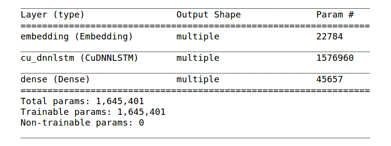

# Assignment 4 (2018-2019)
[Text generation with RNNs](https://www.tensorflow.org/tutorials/sequences/text_generation)
`Char-RNN-TensorFlow.ipynb`

## Architecture & other details
### Architecture
EmbeddingLayer(embedding_dim=256) -> LSTM(units=512) -> FC(vocab_size=89)  
Model summary

### Details
* seq_length: 100
* batch_size: 64
* epochs: 150
* loss: softmax_cross_entropy
* optimizer: Adam (with default arguments)
 
## Data
I trained the RNN on 3 Harry Potter books (1st, 3rd, 4th): `./data/input.txt`

## Results
| epoch | loss | start string | generated text |
| :---: | :---: | :---: | :---: |
| 5 | 1.33 | "H" | HANG––888888888888888888888888888888888888888888888888888888888 ... |
| 5 | 1.33 | "Harry is" | Harry is a second that the start of the start of the start of the start of the corridor was still starting to the start of the corridor was still starting to ... |
| 5 | 1.33 | "Azkaban" | Azkabanxw and starting to the start of the corridor was still starting to the start of the corridor was still starting to the start of the corridor was still ... |
| 15 | 1.13 | "H" | HARE!" Harry yelled. "I was a bit of a bit of a bit of a bit of a bit of a bit of a bit of ... |
| 15 | 1.13 | "Harry is" | Harry is a bit of a bit of a bit of a bit of a bit of a bit of a bit of a bit of a bit of a bit of a bit of a bit of a bit of a bit of a bit of a bit of a bit ... |
| 15 | 1.13 | "Azkaban" | Azkaban. "I was a bit of a bit of a bit of a bit of a bit of a bit of a bit of a bit of a bit of a bit of a bit of a bit of a bit of a bit of a bit of a bit ... |
| 30 | 1.01 | "H" | Harry was still staring at him. "I wonder what we went to know what the same words were still in the morning on the grounds. The stars were still in the stands to the staff table and started to show the spells of the castle and started to show him on ... |
| 30 | 1.01 | "Harry is" | Harry is supposed to be a bit of a bit of a bit of a bit of a bit of a bit of a bit of a bit of a bit of a bit of a particularly little person to his feet. He was still staring at him. "I wonder what we went to know what the same words were still in the morn ... |
| 30 | 1.01 | "Azkaban" | Azkaban goblin read of the school of the students and the spell as though he were a few seconds later, the spider stood up and down the stairs and pulled out his wand and started to show the spells of the castle and started to show him on the stairs. He was ... |
| 50 | 1.01 | "H" | HARRY POTTER   THE MINISTRY OF MAGIC CAME AND DAD WOUR FIRST AT THE FIREST   The silence was staring at the silvery light of the statue of the staff table. The sky outside the carriage was staring at the silvery light of the statue of the staff table. The sky outside the carriage was staring at the s ... |
| 50 | 1.01 | "Harry is" | Harry is a state of seventeen will be possible, the truth was a bit of a single pair of the last time he had to start a lot of silvery light of the train that the class stood up and stared at the staff table. The sky outside the carriage was staring at the silvery light of the statue of the staff table. The ... |
| 50 | 1.01 | "Azkaban" | Azkaban looked at Harry as though he were a lot of wind and several people were staring at the silent sight of the castle and the students were staring at the silent sight of the castle and the students were staring at the silent sight of the castle and the students were staring at the silent sight of the ... |
| 100 | 0.88 | "H" | HE'RRING ­­ THE EAROUS SERECTES BREAD    Harry thought that the Dursleys were a bit of a table. Harry saw the spell hit the first task. The staffroom, the stars appeared and landed with a snap, and he stood up, stretched out his wand and said, "I was just talking about the Sorcerer's Stone at all. . . |
| 100 | 0.88 | "Harry is" | Harry is so stupid. They say it was a horrible smile.   "We should have seen the password," said Harry.  "Well, they're not supposed to be a minute to the Ministry of Magic and was having a lot of those who had been so sorry ­ hic ­ the matter will take place at the moment, Harry had no idea what he was goin ... |
| 100 | 0.88 | "Azkaban" | Azkaban wizards around him. He was still shaking against the wall. Harry stared at him. Harry could have sworn he had got through the first task. The staffroom, the stars appeared and landed on the wall. Hagrid was staring at the staff table and had a few seconds later, they had been a bit of a heap of str ... |
| 150 | 0.83 | "H" | H"  Harry felt a great witch in front of him, and there was a soft thump and dangerous as his feet and set off at the sight of the first years.  A sudden seats draw under his brain.   He could see a silence so that his face was still staring at the egg in the dark and silver and glasses.  "Harry!" she said. "They were trying to stop us!"  Harry didn't say anything. He pulled out the stairs to the ground behind him.  "So that's what you mean, they were playing competing," said Lupin, still sitting ... |
| 150 | 0.83 | "Harry is" | Harry is going to get there!"  "I think I will be able to see the bushes," said Hagrid in a very fine at Krum's voice. He was looking at the first task filled the castle and started to show the house­elves in the shadows, and the sound of the solidement was so dark they could see through the darkness, the hand pointed out of the way to Harry to his feet. "It was a minute ­­"  "The Dark Mark what they were talking about?" said Ron, who was still sitting on the stone steps into the castle and the stairs t ... |
| 150 | 0.83 | "Azkaban" | Azkaban trees behind him.  "So what are you doing here?" said Harry. "I don't know what I see the third task."  "What?" said Harry. "There was the best school aloud.   "And what are you talking about?" said Ron, who was still sitting on the stone steps into the castle and the stairs to the door, whose handle was sitting at the stands around the side of the staircase and pulled on the stone steps, to the floor. He was wearing a long sigh and started to do it.  "It's too late," said Harry. "I would all ... |

