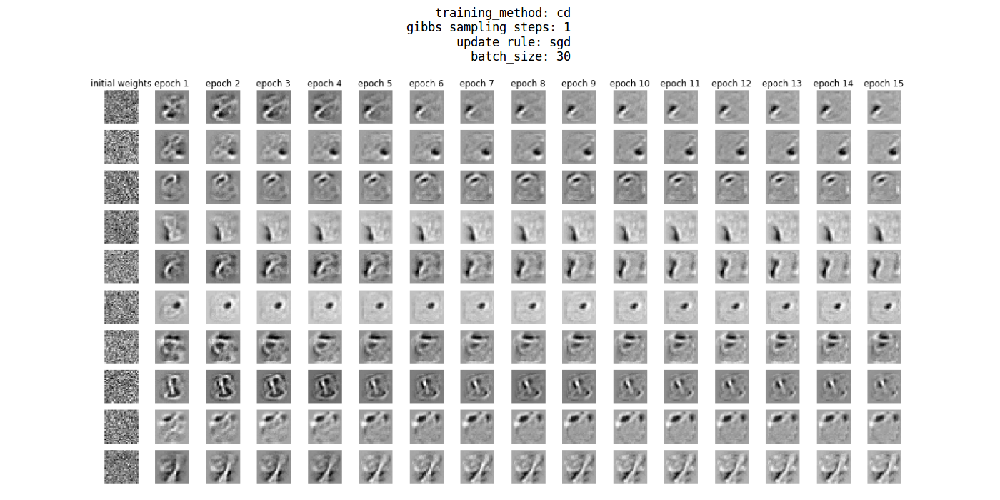
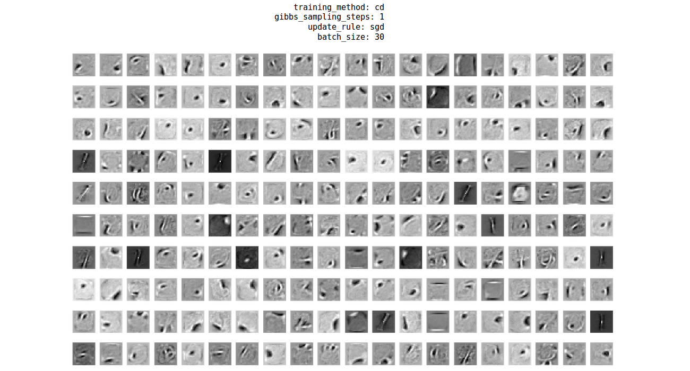
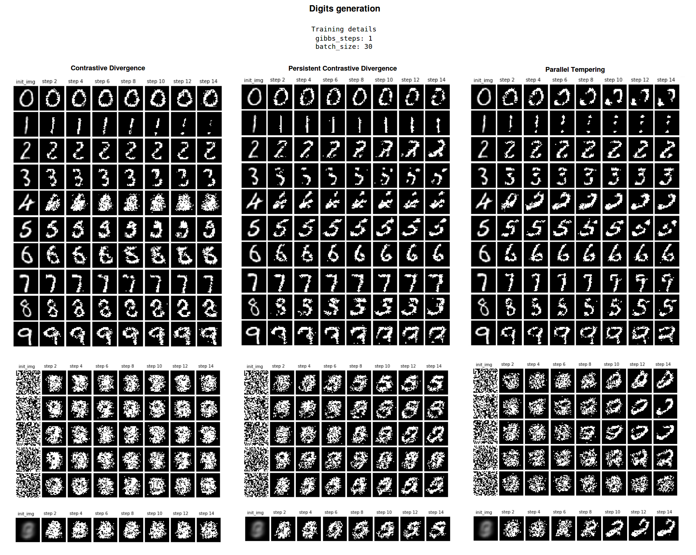
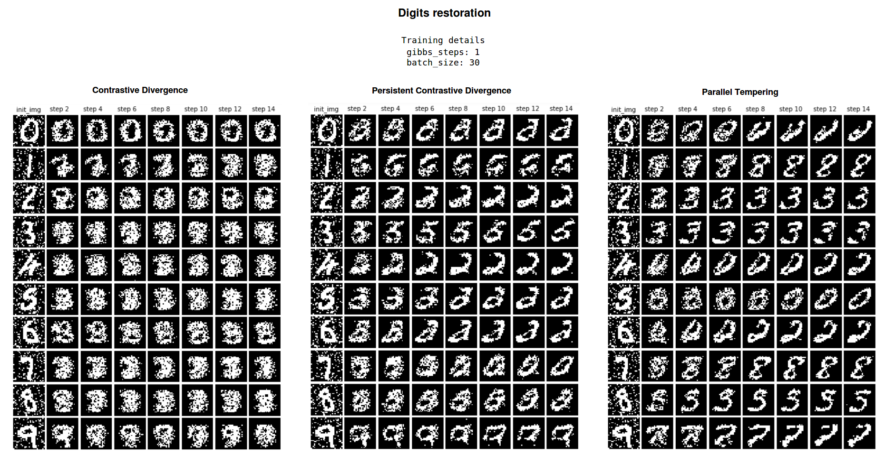
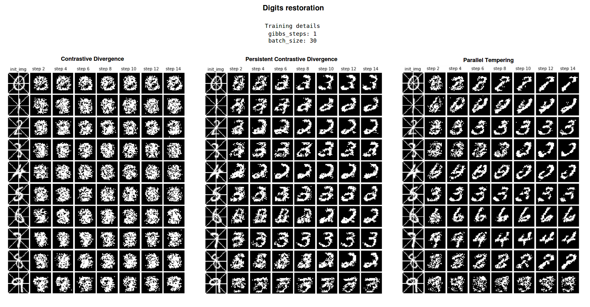
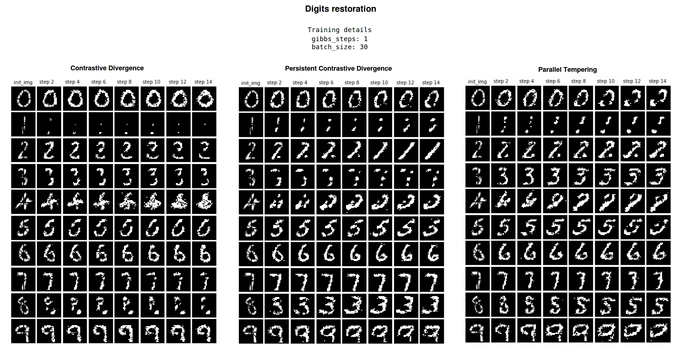

# Assignment 5 (2018-2019)
__Restricted Boltzmann Machines (RBMs)__

## Training methods
* Contrastive Divergence
* Persistent Contrastive Divergence
* Parallel Tempering

## Applications
* Feature extraction (leverage the availability of unlabeled data)
* Data generation
* Data compression
* Image restoration

> RBMs are most often used as feature extractors.  
> VAEs and GANs are better generative models than RBMs.

## Visualizing weights during the training phase
* The learned features correspond to the weights of RBM hidden units.
* Evolution of the learned features during the training: random -> global -> local.

* The final weights are shown below.

## Results

___

___

## References
1. [Training Restricted Boltzmann Machines using Approximations to the Likelihood Gradient (Tieleman, 2008)](https://www.cs.toronto.edu/~tijmen/pcd/pcd.pdf)
2. [Parallel Tempering for Training of Restricted Boltzmann Machines (Desjardins et al., 2010)](https://pdfs.semanticscholar.org/a5eb/54e8a30406ac723ba258111239e156e25523.pdf)
3. [Lecture12: RBMs (Vineeth N Balasubramanian, 2016)](https://www.iith.ac.in/~vineethnb/teaching/spr2016/atml/Lec12-RBMs.pdf)
4. [Training Restricted Boltzmann Machines: An Introduction](https://christian-igel.github.io/paper/TRBMAI.pdf)
5. [A Practical Guide to Training Restricted Boltzmann Machines (Hinton, 2010)](http://www.cs.toronto.edu/~hinton/absps/guideTR.pdf)
6. [Introduction to RBMs](http://blog.echen.me/2011/07/18/introduction-to-restricted-boltzmann-machines/)
7. [RBM tutorial (deeplearning.net)](http://deeplearning.net/tutorial/rbm.html)
8. [(Coursera) Lecture 12.3 — Restricted Boltzmann Machines [Neural Networks for Machine Learning, Hinton]](https://www.youtube.com/watch?v=JvF3gninXi8&list=PLoRl3Ht4JOcdU872GhiYWf6jwrk_SNhz9&index=57)
9. [(Coursera) Lecture 12.4 — An example of RBM learning [Neural Networks for Machine Learning, Hinton]](https://www.youtube.com/watch?v=2gWEP6IewgM&index=58&list=PLoRl3Ht4JOcdU872GhiYWf6jwrk_SNhz9)
10. [Neural networks [5.1]: RBM - definition](https://www.youtube.com/watch?v=p4Vh_zMw-HQ)
11. [Neural networks [5.2]: RBM - inference](https://www.youtube.com/watch?v=lekCh_i32iE)
12. [Neural networks [5.3]: RBM - free energy](https://www.youtube.com/watch?v=e0Ts_7Y6hZU)
13. [Neural networks [5.4]: RBM - contrastive divergence](https://www.youtube.com/watch?v=MD8qXWucJBY)
14. [Neural networks [5.5]: RBM - contrastive divergence (parameter update)](https://www.youtube.com/watch?v=wMb7cads0go)
15. [Neural networks [5.6]: RBM - persistent contrastive divergence](https://www.youtube.com/watch?v=S0kFFiHzR8M)
16. [Neural networks [5.7]: RBM - example](https://www.youtube.com/watch?v=n26NdEtma8U)
17. [Neural networks [5.8]: RBM - extensions](https://www.youtube.com/watch?v=iPuqoQih9xk)
18. [RBMs for beginners](https://skymind.ai/wiki/restricted-boltzmann-machine)
