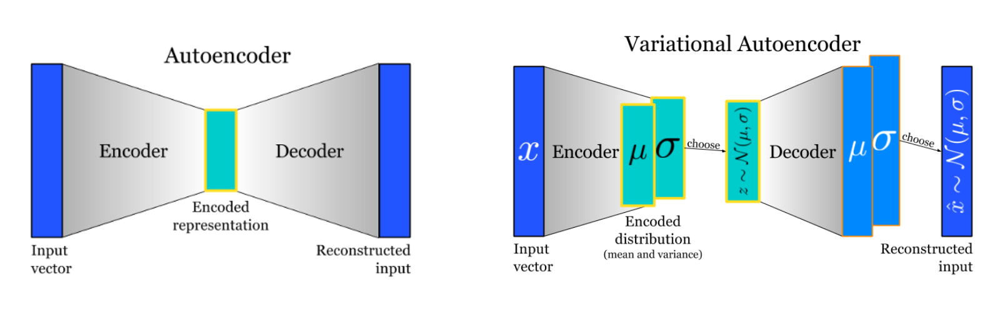
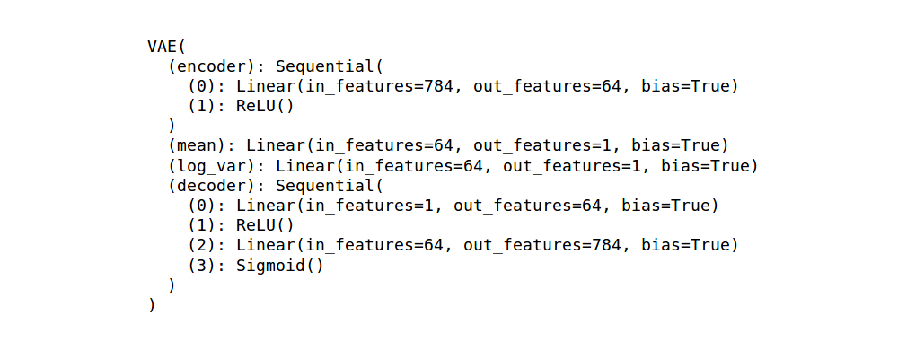
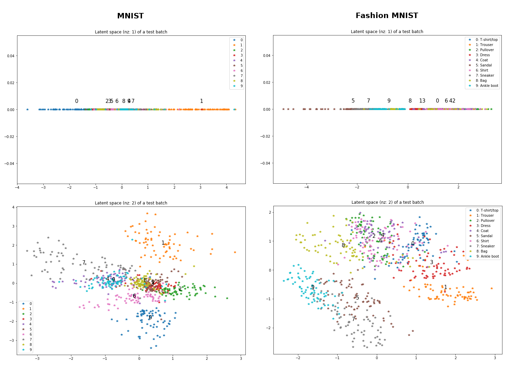
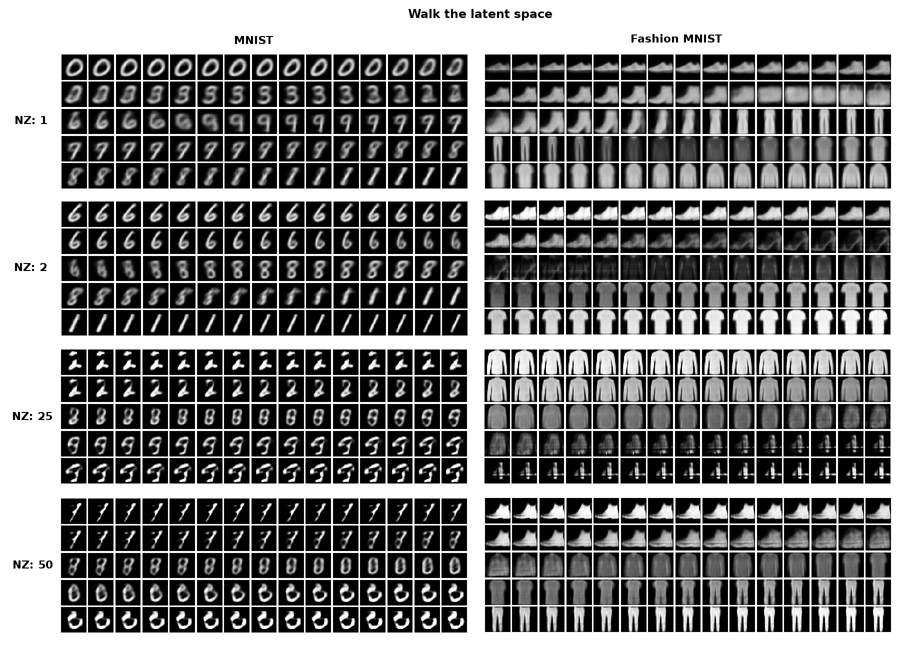
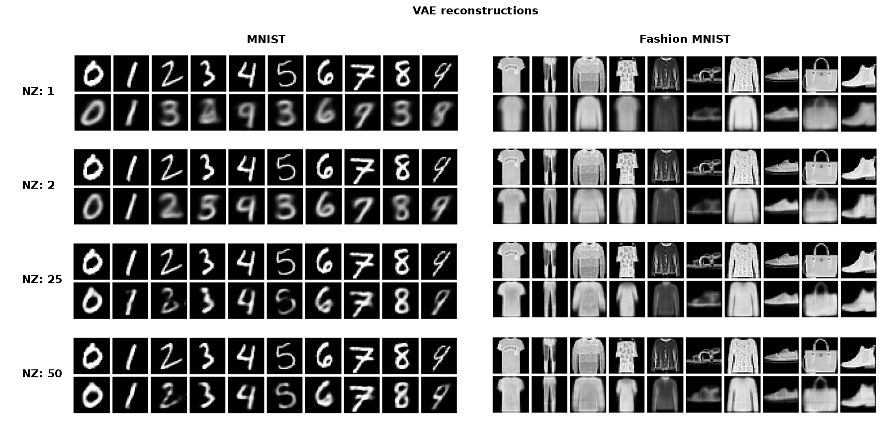
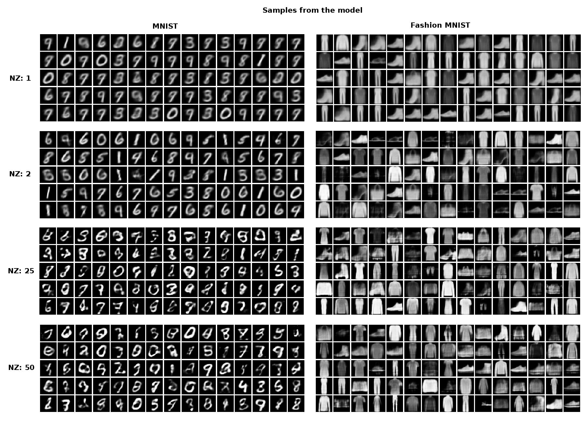

# Assignment 6 (2018-2019)
__Variational Autoencoders (VAEs)__ - generative autoencoders.

[Image source](https://blog.shazam.com/learning-to-understand-music-from-shazam-56a60788b62f)

## Architecture

## Training details
* num_epochs: 500
* batch_size: 100
* latent sizes nz: 1 | 2 | 25 | 50
> I trained VAEs with different latent sizes (nz) and compared their results.

## Weights visualization

## Latent space visualization

## Results

## References
1. [Variational Autoencoders (Arxiv Insights)](https://www.youtube.com/watch?v=9zKuYvjFFS8)
2. [Autoencoder Explained (Siraj Raval)](https://www.youtube.com/watch?v=H1AllrJ-_30)
3. [Deep Learning Lecture 14: Karol Gregor on Variational Autoencoders and Image Generation](https://www.youtube.com/watch?v=P78QYjWh5sM)
4. [Lecture 13 | Generative Models (Stanford)](https://www.youtube.com/watch?v=5WoItGTWV54)
5. [Variational Autoencoder: Intuition and Implementation (Agustinus Kristiadi)](https://wiseodd.github.io/techblog/2016/12/10/variational-autoencoder/)

