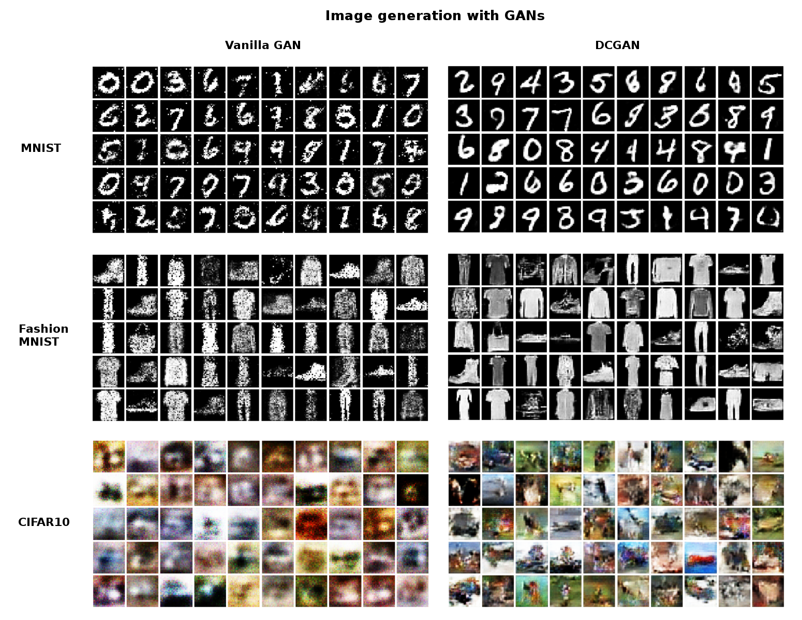
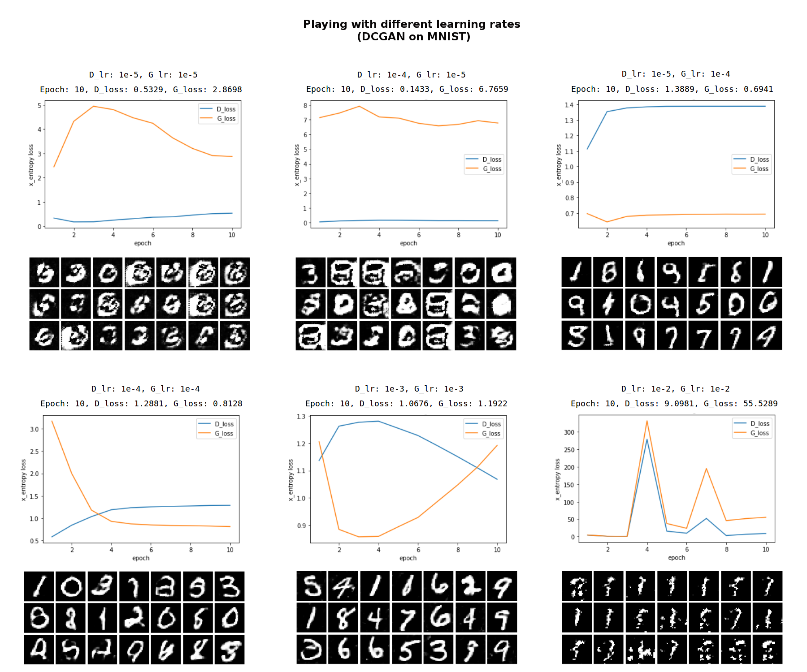

# Assignment 7 (2018-2019)
__Generative Adversarial Networks (GANs)__  
I trained Vanilla and Deep Convolutional GANs on MNIST, FashionMNIST and CIFAR10 datasets.

## Architectures
> __Important__: normalize the images between -1 and 1 (for both VanillaGAN and DCGAN) 

* Some notations:
  - img_h, img_w, img_c = img.shape
  - img_dim = img_h * img_w * img_c
___
### VanillaGAN
__Generator__
1. SampleNoise(U(-1, 1), z_dim=50) 
2. FC(1024, ReLU)
3. FC(1024, ReLU)
4. FC(img_dim, Tanh)
5. Reshape([-1, img_h, img_w, img_c])

__Discriminator__
1. Reshape([-1, img_dim])
2. FC(256, LeakyReLU(0.01))
3. FC(256, LeakyReLU(0.01))
4. FC(1, Sigmoid)
___
### DCGAN
__Generator__
1. SampleNoise(U(-1, 1), z_dim=50) 
2. FC(1024, ReLU) + BatchNorm
3. FC((img_h // 4) * (img_w // 4) * 128, ReLU) + BatchNorm
4. Reshape([-1, img_h//4, img_w//4, 128]) + BatchNorm
5. Conv2d_transpose(filters=64, kernel_size=4, strides=2, padding='same', ReLU) + BatchNorm
6. Conv2d_transpose(filters=img_c, kernel_size=4, strides=2, padding='same', Tanh)

__Discriminator__
1. Pad([[0,0], [0,1], [0,1], [0,0]], 'constant')
2. Conv2d(filters=32, kernel_size=5, strides=2, LeakyReLU(0.01))
3. Conv2d(filters=64, kernel_size=5, strides=2, LeakyReLU(0.01))
4. Flatten()
4. FC(current_h * current_w * 64, LeakyReLU(0.01))
5. FC(1, Sigmoid)

## Training details
* batch_size: 128
* num_epochs: 10
* optimizer: Adam(beta1=0.5)
* lr: 1e-3 (VanillaGAN) | 2e-4 (DCGAN)

## Results

## Experiments: Playing with some hyperparameters

## References
1. [How to Train a GAN? Tips and tricks to make GANs work](https://github.com/soumith/ganhacks)
2. [Lecture 13 | Generative Models (Stanford)](https://www.youtube.com/watch?v=5WoItGTWV54)
3. [Unsupervised Representation Learning with Deep Convolutional Generative Adversarial Networks (Radford, Metz, Chintala, 2016)](https://arxiv.org/abs/1511.06434)
4. [CapsGAN](https://capsgan.wordpress.com/2018/02/26/evaluating-capsule-net-implementation-in-a-generative-adversarial-network/)

