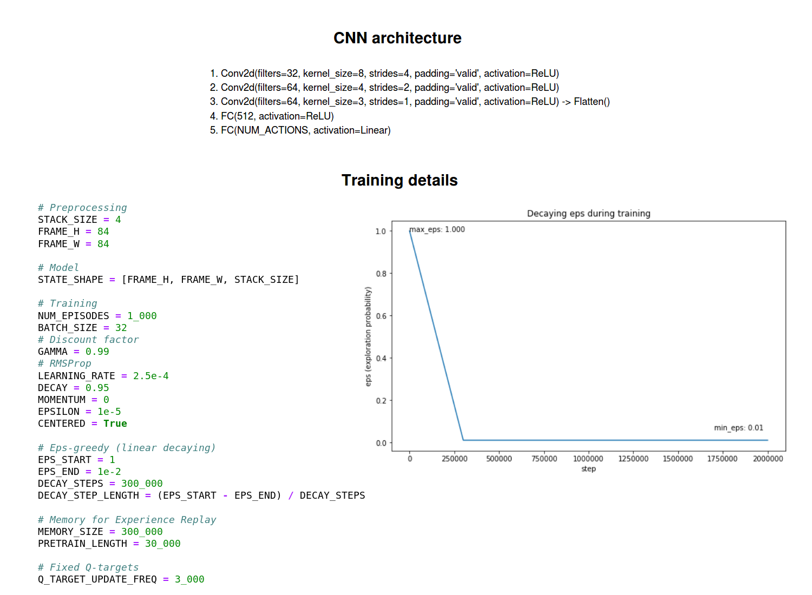
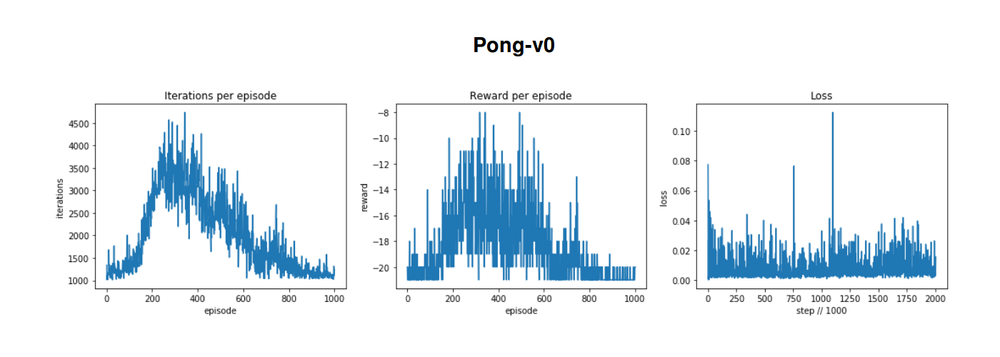
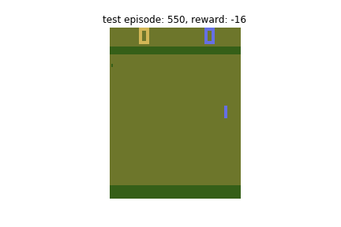

# Assignment 8 (2018-2019)
__Deep Q-Networks (DQNs) on Atari-2600 games__

## DQN: architecture and training details

## Results

| After 250 episodes of training (~472,000 frames) | After 550 episodes of training (~1,342,000 frames) |
| :---: | :---: |
|  |  |

## References
1. [OpenAI Gym (Docs)](https://gym.openai.com/docs/)
2. [OpenAI Gym (Value iteration and Q-learning)](https://www.kaggle.com/charel/learn-by-example-reinforcement-learning-with-gym)
3. [Intro to RL - Part 1 (What is RL ?)](https://medium.com/@adeshg7/introduction-to-reinforcement-learning-part-1-dbfd19c28a30)
4. [Intro to RL - Part 2 (MDPs and Q-learning)](https://medium.com/@adeshg7/introduction-to-reinforcement-learning-part-2-74e0a3fad9d3)
5. [Intro to RL - Part 3 (Coding Q-learning)](https://medium.com/swlh/introduction-to-reinforcement-learning-coding-q-learning-part-3-9778366a41c0)
6. [An introduction to RL - P1 (MC vs TD, 3 approaches to RL: value-based, policy-based, model-based)](https://medium.freecodecamp.org/an-introduction-to-reinforcement-learning-4339519de419)
7. [An introduction to RL - P2 (Diving deeper into RL with Q-Learning)](https://medium.freecodecamp.org/diving-deeper-into-reinforcement-learning-with-q-learning-c18d0db58efe)
8. [An introduction to RL - P3 (Deep Q-Learning)](https://medium.freecodecamp.org/an-introduction-to-deep-q-learning-lets-play-doom-54d02d8017d8)
9. [Welcome to Deep RL: Learning part](https://towardsdatascience.com/welcome-to-deep-reinforcement-learning-part-1-dqn-c3cab4d41b6b)
10. [RL lecture (structure of RL)](http://bicmr.pku.edu.cn/~wenzw/bigdata/MDP.pdf)
11. [RL (general ideas)](https://towardsdatascience.com/my-journey-to-reinforcement-learning-part-0-introduction-1e3aec1ee5bf)
12. [Human-level control through deep reinforcement learning (DeepMind paper)](https://storage.googleapis.com/deepmind-data/assets/papers/DeepMindNature14236Paper.pdf)
13. [Off-policy vs On-policy learning](https://stats.stackexchange.com/questions/184657/what-is-the-difference-between-off-policy-and-on-policy-learning)
14. [Google dopamine (baselines)](https://github.com/google/dopamine/tree/master/baselines)

