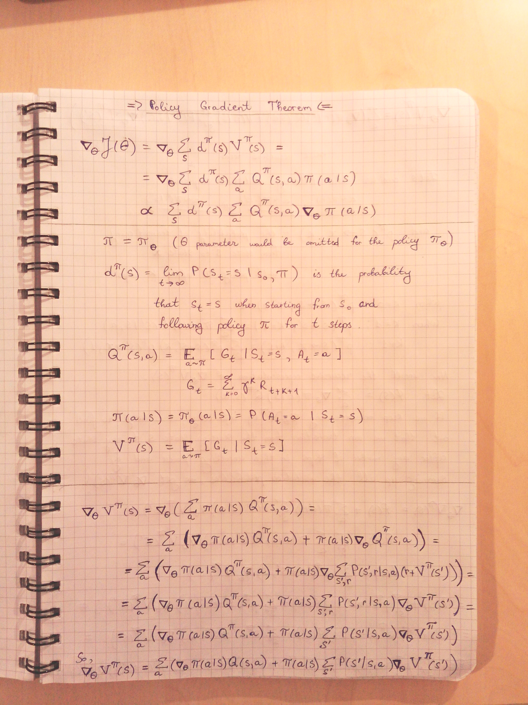
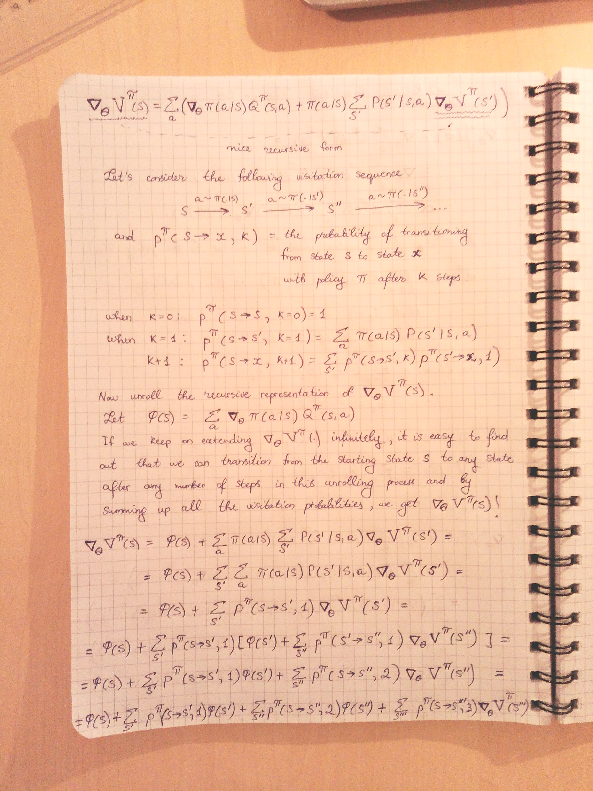
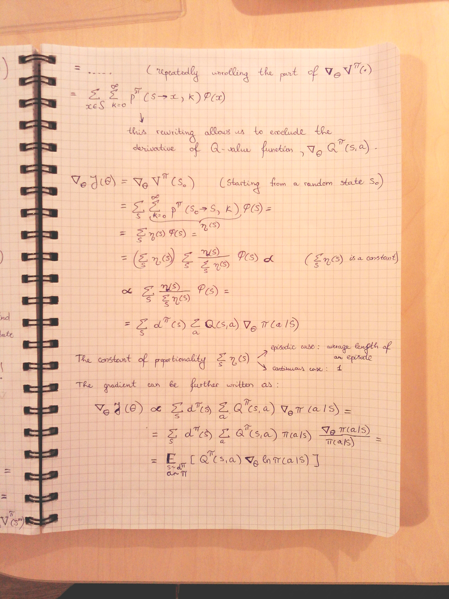

# Assignment 8 (2018-2019)
__Proof of Policy Gradient Theorem (PGTs)__  

## References
1. [Policy gradient algorithms](https://lilianweng.github.io/lil-log/2018/04/08/policy-gradient-algorithms.html#proof-of-policy-gradient-theorem)
2. [Introduction to policy gradients](https://medium.freecodecamp.org/an-introduction-to-policy-gradients-with-cartpole-and-doom-495b5ef2207f)
