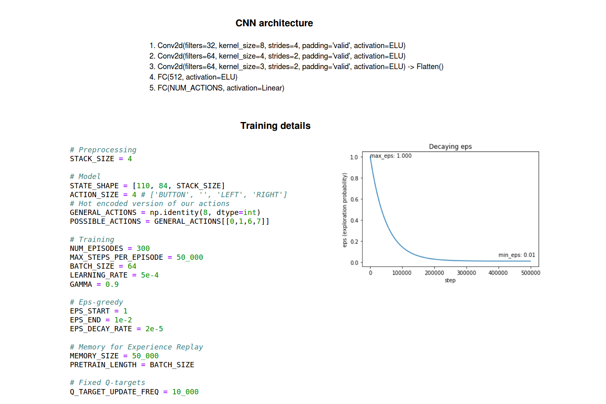
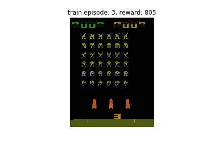
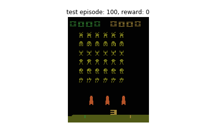

# Tutorial 1: Value iteration
`OpenAI_Gym_1_Value_Iteration.ipynb`

# Tutorial 2: Q-learning
`OpenAI_Gym_2_Q_learning.ipynb`

# Tutorial 3: DQN on SpaceInvaders-Atari2600
0. Roms:  
    a. Download zip file from http://www.atarimania.com/rom_collection_archive_atari_2600_roms.html  
    b. Open Roms.rar > ROMS.rar and find Space Invaders (1980) XXXXXX  
    c. Extract all matches (there are 5 of them) into your destination folder  
    d. python -m retro.import . (don't forget the point)  
1. `OpenAI_Gym_3_DQN_train.ipynb`
2. `OpenAI_Gym_3_DQN_test.ipynb`
3. `Save_train_animations.ipynb`

## CNN architecture and training details

## DQN experiments on SpaceInvaders-Atari2600

| Optimizer | RMSProp(lr=2.5e-4) | RMSProp(lr=1e-3) | RMSProp(lr=1e-2) |
| :---: | :---: | :---: | :---: |
| Train |  |  | 
| Test/Eval |  |  | 

