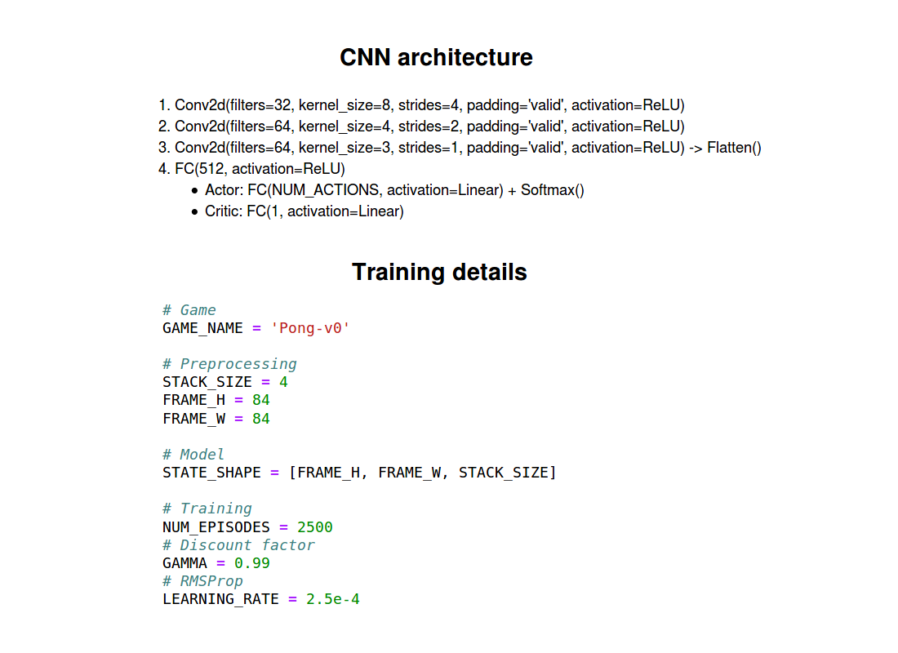

# Assignment 9 (2018-2019)
__Advantage Actor-Critic (A2C) on Atari-2600 games__

## Steps to follow
1. Install `TensorFlow` and `OpenAI Gym`;
2. Modify hyperparameters, constants and game name in `config.py`;
3. Run `A2C_train.ipynb` to train a dqn with the settings from the `config.py`;
4. Run `A2C_test.ipynb` to evaluate your model and to save some animations.

* Feel free to experiment different architectures and preprocessing methods by changing `a2c.py` and `preprocessing.py`.

## A2C: architecture and training details

## Results
Unfortunately I couldn't obtain good results with this implementation/architecture/hyperparameters.
More investigation is needed.

## Some notes
* Value-based methods have __high variability__. To reduce this we can use the _advantage function_ instead of the value function.
* The _advantage function_ is defined like this: A(s, a) = Q(s, a) - V(s). It tells us the improvement compared to the average score of actions taken at that state.
* The problem of implementing this _advantage function_ is that it requires 2 value functions - Q(s, a) and V(s), but we can use the __TD__ error as a good estimator of the advantage function: A(s, a) = r + gamma * V(s') - V(s).

## References
1. [An intro to Advantage Actor Critic methods](https://medium.freecodecamp.org/an-intro-to-advantage-actor-critic-methods-lets-play-sonic-the-hedgehog-86d6240171d)
2. [Intuitive RL: Intro to Advantage-Actor-Critic (A2C)](https://hackernoon.com/intuitive-rl-intro-to-advantage-actor-critic-a2c-4ff545978752)
3. [Deep Reinforcement Learning with Policy Gradients and Actor-Critic Methods](https://www.datahubbs.com/policy-gradients-and-advantage-actor-critic/)
4. [Two-Headed A2C Network in PyTorch](https://www.datahubbs.com/two-headed-a2c-network-in-pytorch/)
