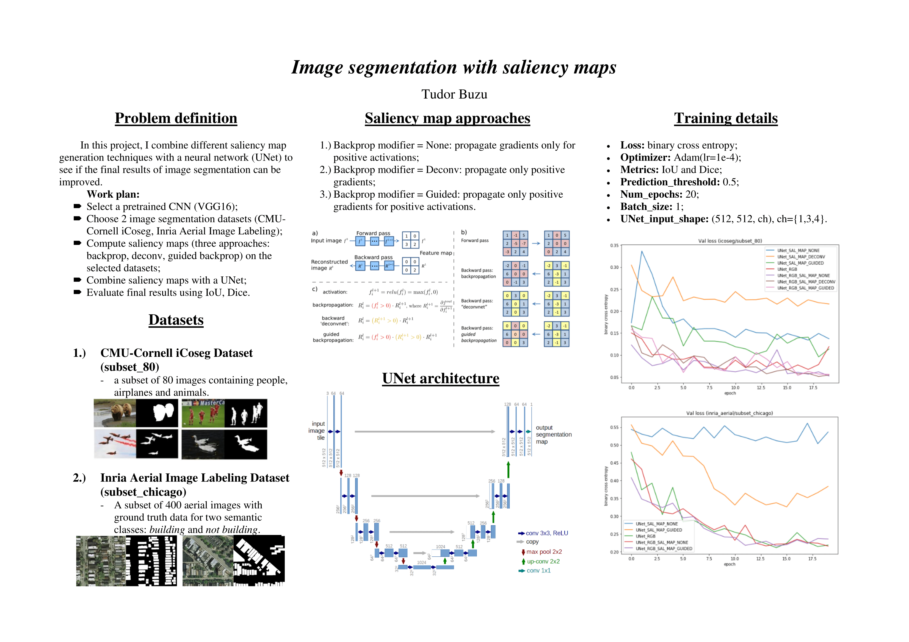
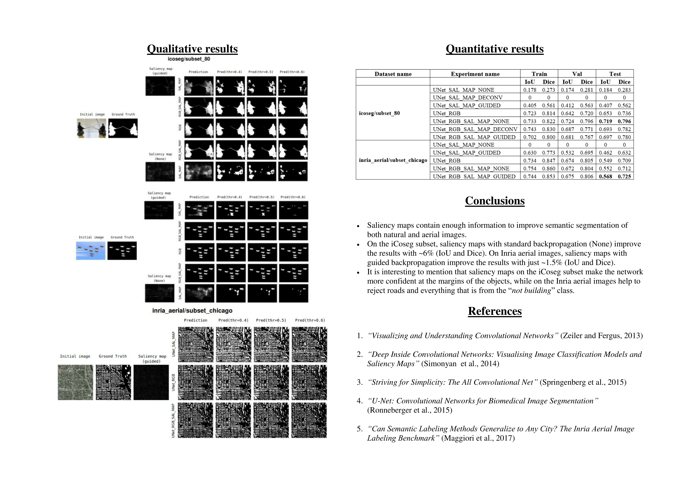

# Project (2018-2019)
__Image segmentation with saliency maps__

## Poster

## Installation
1. Python 3.6
2. TensorFlow (1.11)
3. Keras (2.2.4)
4. keras-vis (last version)
    - `pip install git+https://github.com/raghakot/keras-vis.git`

## Datasets
### __CMU-Cornell iCoseg dataset__
1. Look at some groups of images: http://chenlab.ece.cornell.edu/projects/touch-coseg/iCoseg_dataset.pdf;
2. Download the dataset from: http://chenlab.ece.cornell.edu/downloads.html;
3. Move dataset folders inside the `./datasets/`;
4. Copy 80 images and their ground truths (list of images to be copied: `./datasets/icoseg/subset_80/img_list.txt`).  
`./datasets/icoseg/images/...` -> `./datasets/icoseg/subset_80/images`  
`./datasets/icoseg/ground_truth/...` -> `./datasets/icoseg/subset_80/grund_truth`.
  

Folder structure:

    .
    ├── ...
    ├── datasets
    │   ├── icoseg
    │   │   ├── ground_truth
    │   │   ├── image_download
    │   │   ├── images
    │   │   ├── images_subset5_cvpr10
    │   │   ├── subset_80
    │   │   │   ├── ground_truth
    │   │   │   ├── images
    │   │   │   ├── img_list.txt
    │   │   │   ├── train.txt
    │   │   │   ├── val.txt
    │   │   │   └── test.txt
    │   │   ├── readme.txt
    │   │   └── ...
    │   └── ...
    └── ...

## References
1. [Visualizing and Understanding Convolutional Networks (Zeiler and Fergus, 2013)](https://arxiv.org/abs/1311.2901)
2. [Deep Inside Convolutional Networks: Visualising Image Classification Models and Saliency Maps (Simonyan _et al._, 2014)](https://arxiv.org/abs/1312.6034)
3. [Striving for Simplicity: The All Convolutional Net (Springenberg _et al._, 2015)](https://arxiv.org/abs/1412.6806)
4. [Grad-CAM: Visual Explanations from Deep Networks via Gradient-based Localization (Selvaraju _et al._, 2016)](https://arxiv.org/abs/1610.02391)
5. [iCoseg: Interactive Co-segmentation with Intelligent Scribble Guidance (Dhruv Batra _et al_, 2010)](https://www.researchgate.net/publication/224164344_iCoseg_Interactive_co-segmentation_with_intelligent_scribble_guidance)
6. [U-Net: Convolutional Networks for Biomedical Image Segmentation (Ronneberger _et al._, 2015)](https://arxiv.org/abs/1505.04597)
7. [keras-vis for neural network visualization](https://raghakot.github.io/keras-vis/visualizations/saliency/)
8. https://machinelearningmastery.com/use-pre-trained-vgg-model-classify-objects-photographs/

